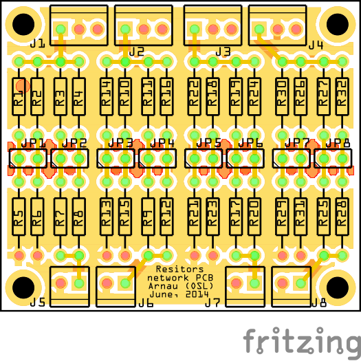

OSL ResNet Board
================

The __OSL ResNet board__ is a small standalone single-layer pcb design for providing some external resistors networks to Arduino designs often used in small robotics projects. This can be used for voltage monitoring tasks for instance in battery metering projects.

The following layout ([fritzing file](resnet_board.fzz)) is taken as reference. The same concept can be implemented differently using SMD components or prototyping boards. 

The main features are the presence of 4 independent resistor networks, screw connectors with ground pins and  jumper headers to change on the fly the values of the total resistance. This board has been designed together with Arnau Puig Mensa.

## LICENSE - "MIT License"

Copyright (c) 2013-2014 Valerio De Carolis, http://decabyte.it

Permission is hereby granted, free of charge, to any person
obtaining a copy of this software and associated documentation
files (the "Software"), to deal in the Software without
restriction, including without limitation the rights to use,
copy, modify, merge, publish, distribute, sublicense, and/or sell
copies of the Software, and to permit persons to whom the
Software is furnished to do so, subject to the following
conditions:

The above copyright notice and this permission notice shall be
included in all copies or substantial portions of the Software.

THE SOFTWARE IS PROVIDED "AS IS", WITHOUT WARRANTY OF ANY KIND,
EXPRESS OR IMPLIED, INCLUDING BUT NOT LIMITED TO THE WARRANTIES
OF MERCHANTABILITY, FITNESS FOR A PARTICULAR PURPOSE AND
NONINFRINGEMENT. IN NO EVENT SHALL THE AUTHORS OR COPYRIGHT
HOLDERS BE LIABLE FOR ANY CLAIM, DAMAGES OR OTHER LIABILITY,
WHETHER IN AN ACTION OF CONTRACT, TORT OR OTHERWISE, ARISING
FROM, OUT OF OR IN CONNECTION WITH THE SOFTWARE OR THE USE OR
OTHER DEALINGS IN THE SOFTWARE.
